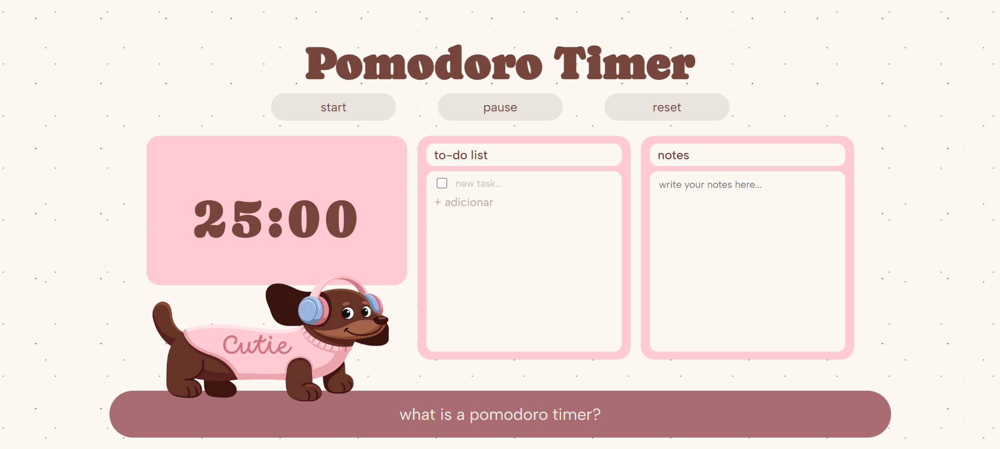
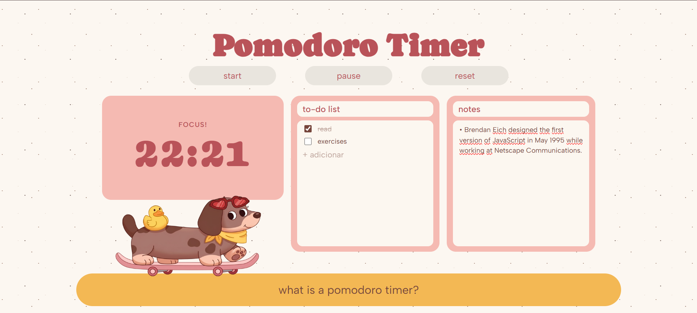

# ⏱️ Pomodoro Timer
[Translate to English](https://github.com/sthefanyalaminos/pomodoro-timer/blob/main/README_EN.md) 

Ambiente de estudos construído em torno da Técnica Pomodoro. A interface adapta seu tema de cores de acordo com o período do dia, noite, manhã ou tarde, e reúne tudo o que você precisa em um só lugar para uma study session: um timer, uma lista de tarefas e um bloco de notas.

<a href="https://pomodoro-timer-sthefanyalaminos.vercel.app/">Clique aqui para acessar!</a>

---

## Funcionalidades

**Timer Pomodoro:**
Alterna automaticamente entre sessões de foco de 25 minutos e pausas de 5 minutos. Conta com controles de iniciar, pausar e reiniciar.

**Lista de Tarefas:**
Adicione tarefas rapidamente, marque as concluídas e crie novas pressionando Enter. Itens concluídos aparecem riscados visualmente.

**Notas:**
Uma área de texto livre para registrar ideias, referências ou qualquer coisa que surgir durante a sessão.

**Temas por Período do Dia:**
A interface detecta o horário atual e aplica um dos três temas, noite, manhã ou tarde, ajustando as cores de todos os elementos automaticamente.

---

## Tecnologias

- HTML5
- CSS3 (Flexbox, custom properties)
- JavaScript
- Google Fonts: [Caprasimo](https://fonts.google.com/specimen/Caprasimo), [Albert Sans](https://fonts.google.com/specimen/Albert+Sans)

---

## Autoria

Desenvolvido por Sthefany Alaminos.
